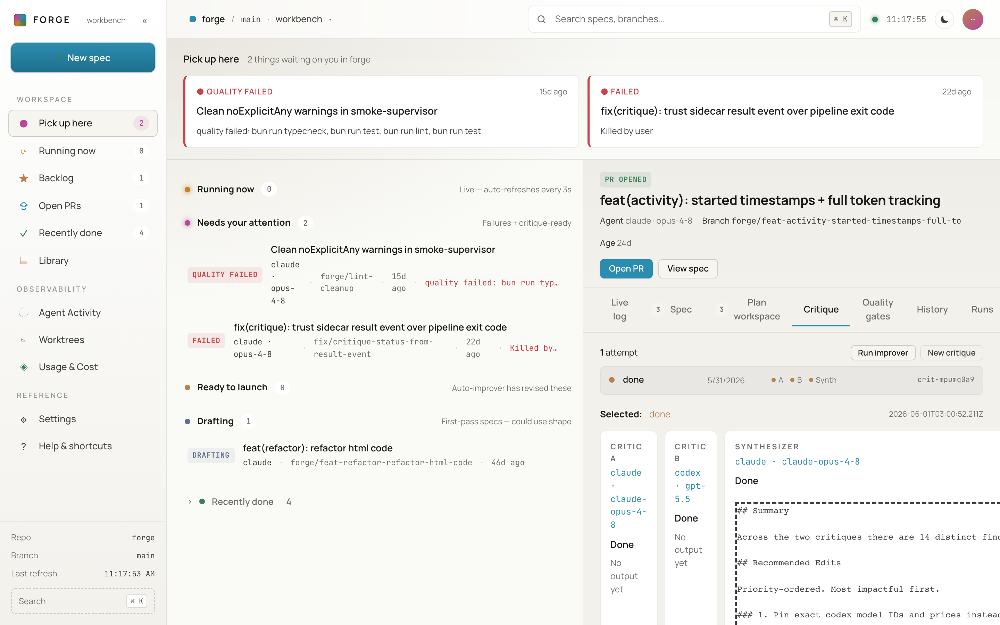
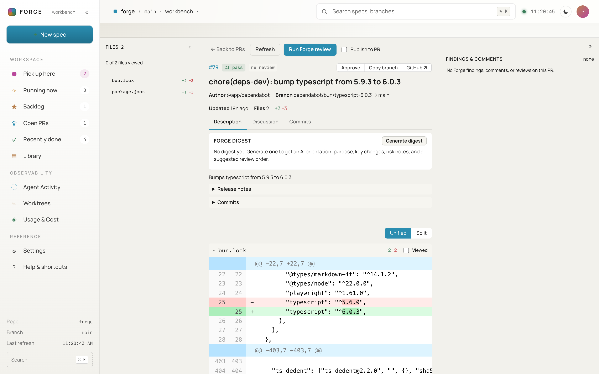
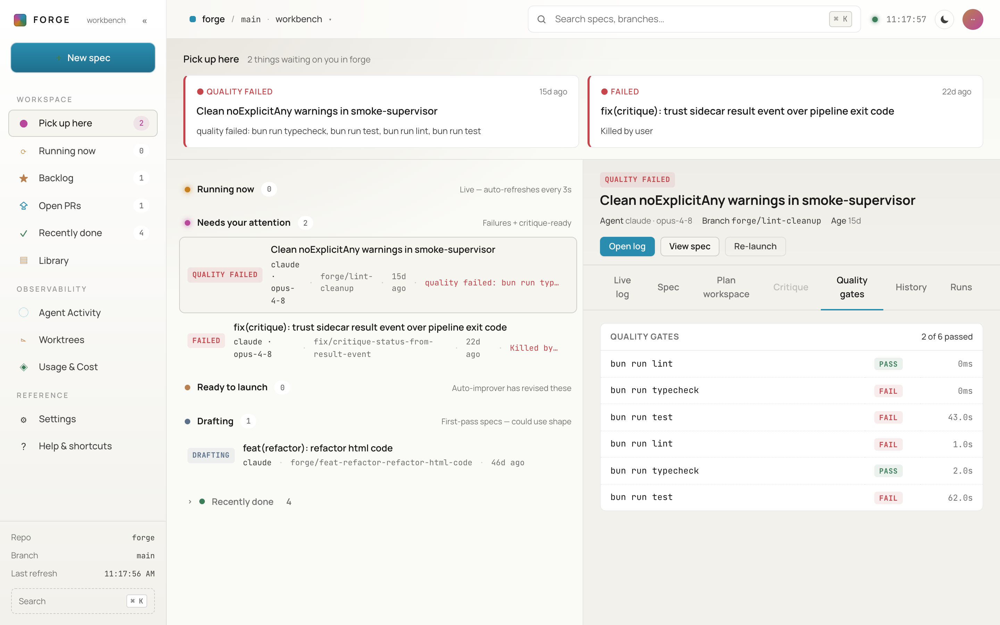
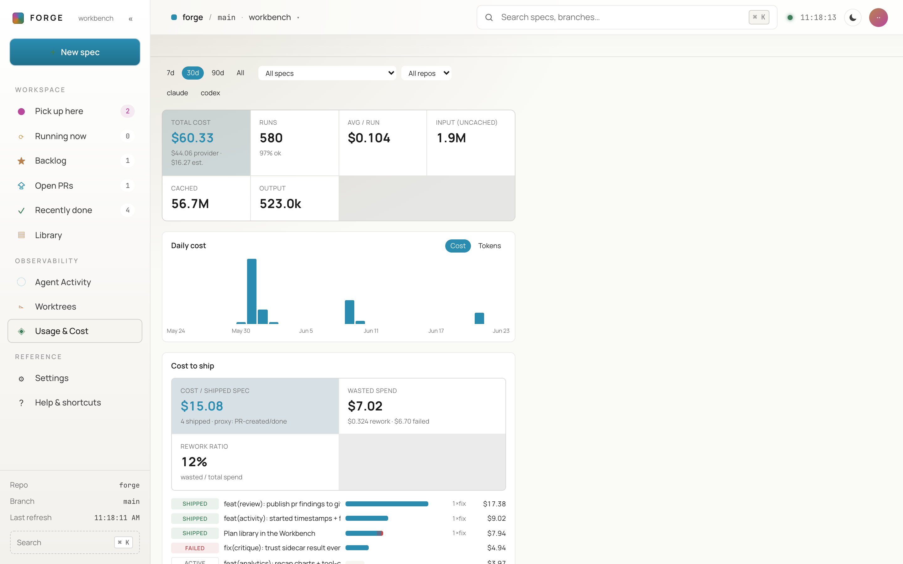

# forge

> The operator's cockpit for staff engineers running agent fleets.
> **Plan. Run. Review. Ship. Don't watch.**

<p align="center">
  <picture>
    <source media="(prefers-color-scheme: dark)" srcset="docs/assets/screenshots/dark/overview.png">
    
  </picture>
</p>

A control plane for one-shot agentic coding runs. You hand it a spec; it spins up `claude` or `codex` (also `opencode` / `gemini`) in a fresh git worktree under tmux, runs your quality gates, opens a draft PR, and sends a different model in to review the diff.

The premise: **a coding-agent session is a job, not a show.** You shouldn't have to watch tool calls scroll or approve every `lint`. Configure your agents once, then dispatch work and triage outcomes — a boss's view, not a manager's view.

**What you get**

- Launch agents headless into isolated git worktrees, each under its own tmux session — run several in parallel without watching any of them.
- Quality gates + a second-model review on every run: the diff lands as a draft PR, auto-reviewed and (optionally) auto-fixed.
- One contract for humans and agents: a `forge` CLI, a localhost **Workbench** web UI, and Claude Code / opencode plugins all drive the same cores.
- Local-first: all state in a SQLite DB under `~/.forge/`. No accounts, no cloud, no telemetry.

**Who it's for:** staff/principal engineers who already run multiple coding agents and have hit the point where *supervision*, not execution, is the bottleneck. If you want to watch an agent work, this isn't that tool. See [`docs/VISION.md`](docs/VISION.md) for the full thesis.

Three artifacts ship from this repo:

- **`forge` CLI** — a `bun`-runtime binary you run from any shell.
- **Claude Code plugin** (`cc-plugin/`) — slash commands and skills that drive the CLI from inside Claude Code.
- **opencode plugin** (`opencode-plugin/`) — slash commands and skills that drive the CLI from inside opencode.

## Prerequisites

- `bun` 1.3+
- `tmux`
- `git`
- `gh` (GitHub CLI, authenticated)
- `python3` (the launch runner's generated `run.sh` shells out to it; ships with macOS CLT)
- `claude` and/or `codex` on PATH (only the runtimes you'll actually launch)

On macOS with Homebrew:

```bash
brew install oven-sh/bun/bun tmux gh
gh auth login        # authenticate the GitHub CLI
# then install at least one agent CLI you'll launch (claude, codex, …)
```

> **Platform note.** Forge is developed and tested on **macOS**. It should work on Linux given the same tools on PATH (`bun`, `tmux`, `git`, `gh`, `python3`), but that path is untested. Windows is not supported (use WSL).

## Install

```bash
git clone https://github.com/tcashel/forge ~/code/forge
cd ~/code/forge
bun install
bun link        # puts ./bin/forge.ts on PATH as `forge`
forge --version
```

For non-developer install once we publish:

```bash
bun install -g https://github.com/tcashel/forge
```

### Claude Code plugin

Symlink `cc-plugin/` into wherever your Claude Code install loads plugins from (typically `~/.claude/plugins/forge/` — exact path depends on your Claude Code version). The plugin assumes `forge` is on `PATH`.

### opencode plugin

Add the repo plugin path to `~/.config/opencode/opencode.jsonc` and restart opencode:

```jsonc
{
  "$schema": "https://opencode.ai/config.json",
  "plugin": ["<forge-repo>/opencode-plugin/plugin.ts"]
}
```

The plugin assumes `forge` is on `PATH`.

## Quickstart

Set per-repo defaults once:

```bash
cd <some-repo>
forge config set reviewerAgent codex
forge config set reviewerModel o3
```

Save a spec from stdin and launch:

```bash
cat plan.md | forge spec save - --title "Add Redis caching" --json
# → { "taskId": "add-redis-caching-mok…", "specPath": "...", "branch": "forge/add-redis-caching" }

forge launch <task-id> --agent claude --model claude-opus-4-7 --json
forge wait <task-id> --until done,failed,quality_failed --json
```

Note: by default `forge spec save` also runs the **auto-improve loop**
(two critics + synthesizer + spec-improver agent subprocesses, synchronously)
and rewrites the spec body in place. Pass `--no-improve` to skip it, or set
`forge config set autoImprove false` per repo.

Or drive the same flow from Claude Code: enter plan mode, produce a plan, exit plan mode, run `/forge-ship-plan`. The planner skill reshapes your plan into the Forge schema and the slash command pipes it into `forge spec save -` for you.

Open the standalone TUI dashboard:

```bash
forge dash
```

Or boot the **Workbench** — a localhost web UI over the same state — with:

```bash
forge serve --open      # default: http://127.0.0.1:7456
```

The Workbench can launch, critique, and kill tasks directly from the UI.
Buttons call into the same programmatic cores the CLI uses, so agents
and humans share one contract. Localhost binding only; no auth. Specs can
be created from the in-UI **New spec** modal (with a planner side-panel) or
via `POST /api/specs` for external tooling.

A coding-agent session is a job: you triage outcomes, not tool calls. The same
surface carries each run from spec through a second-model review:

<table>
  <tr>
    <td width="50%">
      <picture>
        <source media="(prefers-color-scheme: dark)" srcset="docs/assets/screenshots/dark/task-critique.png">
        
      </picture>
      <p align="center"><em>Two-critic + synthesizer spec critique</em></p>
    </td>
    <td width="50%">
      <picture>
        <source media="(prefers-color-scheme: dark)" srcset="docs/assets/screenshots/dark/review.png">
        
      </picture>
      <p align="center"><em>Full-screen PR review &amp; triage</em></p>
    </td>
  </tr>
  <tr>
    <td width="50%">
      <picture>
        <source media="(prefers-color-scheme: dark)" srcset="docs/assets/screenshots/dark/task-gates.png">
        
      </picture>
      <p align="center"><em>Quality gates, per command</em></p>
    </td>
    <td width="50%">
      <picture>
        <source media="(prefers-color-scheme: dark)" srcset="docs/assets/screenshots/dark/usage.png">
        
      </picture>
      <p align="center"><em>Usage &amp; cost — what each shipped spec cost</em></p>
    </td>
  </tr>
</table>

More views and short walkthrough GIFs live in [`docs/assets/`](docs/assets/).

## Your first run

A complete end-to-end pass, from a clean checkout to a reviewed PR:

```bash
# 1. Install (see Prerequisites above for the tools)
git clone https://github.com/tcashel/forge ~/code/forge
cd ~/code/forge && bun install && bun link
forge --version

# 2. In the repo you actually want to work on, pick a reviewer
#    (it must differ from the implementer agent)
cd ~/code/your-project
forge config set defaultAgent claude
forge config set defaultModel claude-opus-4-8   # implementer needs a model
forge config set reviewerAgent codex
forge config set reviewerModel gpt-5.5

# 3. Save a spec and launch an agent on it
echo "Add a /healthz endpoint that returns 200 OK with the build SHA." \
  | forge spec save - --title "Add healthz endpoint" --json
# → { "taskId": "add-healthz-endpoint-…", "branch": "forge/add-healthz-endpoint" }

forge launch <task-id> --json     # runs headless in a worktree + tmux
forge wait <task-id> --until done,failed,quality_failed --json

# 4. Watch and review from the Workbench (or stay on the CLI)
forge serve --open                # http://127.0.0.1:7456
```

The agent runs in a fresh git worktree under tmux, your quality gates run, a
draft PR is opened, and a second model reviews the diff. Use `forge ls` to see
tasks, `forge logs <task-id> -f` to follow output, and `forge review <pr>` to
re-run or publish a review. Nothing required you to watch the session.

> **First time?** `forge spec save` also runs an auto-improve loop by default
> (two critics + a synthesizer). To skip it on your first run, pass `--no-improve`
> or set `forge config set autoImprove false`.

## Subcommand reference

| Command | Purpose |
|---|---|
| `forge spec save [-/--from-file]` | Save a draft from stdin or file. Generates frontmatter + task id. Runs auto-improve by default (`--no-improve` to skip). |
| `forge spec ls [--archived\|--all]` | List draft specs (drafts only by default). |
| `forge spec show <id> [--raw]` | Print a saved spec. |
| `forge spec improve <id>` | Re-run the auto-improve loop on a saved spec. |
| `forge spec diff <id> [--from <critiqueId>]` | Unified diff of the original vs. live spec body. |
| `forge spec archive <id>` / `unarchive <id>` | Soft-archive a draft (files stay on disk). |
| `forge launch <id>` | Launch a draft (claude/codex/opencode/gemini) into tmux + worktree. Defaults from `forge config`. |
| `forge attach <id>` | Exec into the task's tmux session. |
| `forge ls` | List tasks (current repo by default; `--all` for global). |
| `forge status <id>` | Status, run meta, optional log tail. |
| `forge logs <id> [-f]` | Tail or follow agent.log. |
| `forge wait <id>` | Block until terminal status (`--until done,failed,quality_failed`). NDJSON heartbeats to stderr. |
| `forge critique <id>` | Two-critic + synth adversarial spec critique. |
| `forge review <pr>` | Compose the reviewer prompt for a PR — or run the whole review with `--run [--publish]`. See [Review pipeline](#review-pipeline). |
| `forge history <id>` | Unified timeline of every recorded event for a plan. |
| `forge plan get/update/…/lock <id>` | Structured plan-document editing (used by the Workbench planner). |
| `forge run ls <id>` / `run show <id> <n>` | List prior jobs for a plan / show one job's detail. |
| `forge worktree list/remove/clean-merged/test/restore` | Manage the per-task git worktrees, with safety badges. |
| `forge migrate [from-json]` | One-time idempotent backfill of `~/.forge/` JSON into `forge.db`. |
| `forge session start/finish` | Record-only helper the bash runner calls around agent invocations (not for interactive use). |
| `forge config get/set/list <key> [<value>]` | Per-repo settings (reviewer/critique pairs, timeouts, gh user/host, JIRA project). |
| `forge dash` | Mission-control TUI. |
| `forge serve [--port N] [--open]` | Boot the Workbench (web UI) on localhost. |

Every command supports `--json` and a stable error envelope:

```json
{ "ok": false, "error": { "code": "NO_TMUX", "message": "tmux not found on PATH", "hint": "brew install tmux" } }
```

Exit codes: `0` ok, `1` user error, `2` precondition (no tmux/gh/git/TTY), `3` runtime failure, `4` `forge wait` timeout / `forge review` publish failure. `forge wait` additionally uses `3` for a stalled run; `forge spec diff` uses `1` to mean "diff present".

### Per-repo config keys

Set with `forge config set <key> <value>` (full list in `forge config --help`):

- `defaultAgent` / `defaultModel` — implementer fallback for `forge launch`
- `reviewerAgent` / `reviewerModel` (+ `reviewerReasoningEffort`) — reviewer pair, must differ from the implementer
- `fixerAgent` / `fixerModel` / `fixerReasoningEffort`, `autoFix`, `autoFixRounds`
- `critiqueAgentA/B/Synth` + models/reasoning, `improverAgent`/`improverModel`/`improverReasoning`, `autoImprove`
- `agentTimeoutMinutes` (default 120), `reviewerTimeoutMinutes` (default 60), `fixerTimeoutMinutes` (default 60) — per-phase subprocess budgets for the launch runner, the ad-hoc reviewer, and the comment-fix worker
- `ghUser` / `ghHost`, `jiraProject` / `jiraType`

## Review pipeline

`forge review <pr>` is the operator's PR reviewer. Three modes:

```bash
forge review 123                  # compose the reviewer prompt (gh + spec lookup baked in); pipe to claude/codex
forge review 123 --run            # run the reviewer agent here, synchronously; writes findings.json + review.md
forge review 123 --run --publish  # …and publish findings to the PR as review comments
forge review 123 --publish-only   # skip the reviewer; re-run the idempotent publish from the latest saved findings
```

Publishing is **at-least-once with persisted per-finding state** (ADR-0031):

- Every review run writes `publish.json` to its run dir (`~/.forge/runs/pr-review/<pr>-<sessionId>/`): an overall state (`published | partial | failed | nothing-new | not-requested | reconcile-failed`) plus a per-finding outcome (`posted | already-published | skipped-colocated | out-of-diff-posted | failed`, with error text).
- Posting is **idempotent**: each comment embeds a hidden `<!-- forge-finding id=… -->` marker, so re-runs update/skip instead of duplicating. A new-id finding that anchors exactly where a live Forge comment already sits is skipped as a re-titled duplicate — recorded as `skipped-colocated` (an inference, distinct from the marker-verified `already-published`) so it stays auditable.
- Findings that don't anchor on the diff fall back to the review summary body (`out-of-diff-posted`); one bad anchor no longer sinks the batch.
- A requested-but-failed publish sets the session's error field, so `forge status`, the review history, and the Workbench all surface it loudly.
- **Retry path:** `forge review <pr> --publish-only` (or the Workbench retry action) re-runs the publish at any time from the saved `findings.json`.

Exit codes for `--run` / `--publish-only`: `0` success, `1` review failed (or no saved findings for `--publish-only`), `4` publish failed or partial (review artifacts are still saved).

The launch pipeline's auto-review also extracts findings to `findings.json`, so launch reviews are publishable through the same `--publish-only` retry verb.

## State

Forge keeps everything in `~/.forge/` (override with the `FORGE_HOME` env var — used by tests and headless runs to redirect state without touching the real directory):

```
~/.forge/
  forge.db           # SQLite store (plans, jobs, sessions, events) — primary since the ADR-0023 cutover
  specs/             # saved spec markdown per task
  runs/<task-id>/    # per-run logs, meta.json, runner script, prompt
  runs/pr-review/    # ad-hoc review runs: findings.json, review.md, publish.json, agent.log
  critiques/<id>/    # critic+synth output per critique invocation
  plan-drafts/       # Workbench planner conversation drafts
  index.json         # task index (locked atomically on writes)
  repo-config.json   # per-repo settings keyed by absolute repo root
```

Writes are atomic (temp + fsync + rename). Read-modify-writes on `index.json` and `repo-config.json` use an `O_EXCL` lockfile so concurrent writers don't lose updates.

### Task statuses

`forge ls` / `forge status` / the Workbench report one of: `draft`, `running`, `quality_check`, `creating_pr`, `fixing`, `done`, `failed`, `quality_failed`, `archived` (the runner-only `reviewing` phase appears in run metadata, not in the task status). The launch runner transitions through these phases for real and always writes exactly one terminal status — a dead agent, failed gate, or failed PR creation surfaces as `failed` / `quality_failed`, never as a silently stuck `running`.

## Repo layout

```
forge/
├── bin/forge.ts              # bun shebang shim
├── src/
│   ├── cli/                  # subcommand dispatch + per-command files
│   ├── core/                 # store, launch, critique, gh, jira, repo, reviewer, pr-body
│   ├── tui/                  # theme, keys, width, render-loop, dashboard
│   └── web/                  # Workbench HTML served by `forge serve`
├── skills -> cc-plugin/skills  # symlink so the CLI sees the plugin's skills
├── cc-plugin/                # Claude Code plugin (in tree)
│   ├── .claude-plugin/plugin.json
│   ├── commands/             # 7 slash commands
│   ├── skills/               # 7 skills used by the CLI and the plugins
│   │   ├── forge-planner/
│   │   ├── forge-reviewer/
│   │   ├── forge-critic/
│   │   ├── forge-synthesizer/
│   │   ├── forge-fixer/
│   │   ├── forge-comment-fixer/
│   │   └── forge-spec-improver/
│   └── README.md
├── opencode-plugin/          # opencode plugin (in tree)
│   ├── plugin.ts             # registers commands + skills via config hook
│   ├── commands/             # 7 slash commands
│   └── README.md
└── tests/                    # bun test
```

## Development

```bash
bun test              # tests
bun run lint          # biome check .
bun run check         # biome check --write .
```

## Status

- Pre-release (0.4.0). API and config keys may change.
- Pi (the previous host) is removed entirely. The pre-rip snapshot is tagged `pre-rip-v0.3.0`.
- `forge resume` is not yet wired — the supervisor that backed it was pi-specific. Re-launching a failed spec from scratch is the current path.

## Vision & roadmap

Forge **is the deliverable** — the operator's cockpit for staff engineers running agent fleets. See [`docs/`](docs/) for the full vision, roadmap, architecture, schema, and decision log (ADRs). Start at [`docs/README.md`](docs/README.md).

## Contributing

Issues and PRs are welcome — see [CONTRIBUTING.md](CONTRIBUTING.md) for dev
setup, quality gates, and the ADR process. Security reports go through the
private channel in [SECURITY.md](SECURITY.md), not public issues.

## License

[MIT](LICENSE) © Tripp Cashel.
