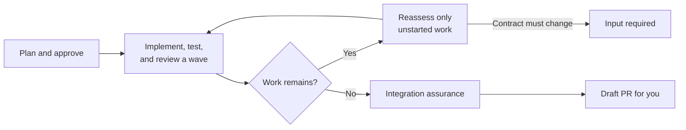

# Forge

[](https://codecov.io/gh/tcashel/forge)

> Plan. Run. Review. Ship. Don't watch.

**Turn an approved rolling epic into a reviewed, tested draft pull request
without babysitting agent sessions.**

Forge treats coding-agent sessions as durable jobs. Plan with one lead agent,
approve the boundaries, then let Forge execute rolling waves of implementation,
tests, independent review, and bounded fixes. You get one draft pull request—or
a precise question. Forge is for experienced engineers who trust headless agents.

## Why Forge

- **Leave the session.** Detached controllers outlive the initiating agent.
- **Keep the plan honest.** Forge reassesses only predeclared, unstarted work;
  changed outcomes, scope, or authority stop for your decision.
- **Bring your own agents.** Use Claude Code, Codex, or Pi with your own accounts.
- **Scale past one terminal.** Submit multiple epics and inspect durable status
  instead of watching tool-call streams.
- **Keep control.** Forge may integrate clean child work, but never merges the
  default branch.


```mermaid
flowchart LR
    A["Plan and approve"] --> B["Implement, test,<br/>and review a wave"]
    B --> C{"Work remains?"}
    C -->|Yes| D["Reassess only<br/>unstarted work"]
    D --> B
    C -->|No| E["Integration assurance"]
    E --> F["Draft PR for you"]
    D -->|Contract must change| G["Input required"]
```

Forge keeps state under `~/.anvil`, adds no hooks or policy files to target repos,
and requires no Forge-hosted service. Network access uses only services you configure.

## Install

Starting with the published `v0.5.0` release, the installer checks the archive
against the release's SHA-256 manifest, then installs the CLI and plugin bundle
under `~/.local`:

```sh
curl -fsSL https://github.com/tcashel/forge/releases/latest/download/install.sh | sh
```

The CLI lands at `$HOME/.local/bin/forged`; the plugin lands at
`$HOME/.local/share/forge`. The installer does not use `sudo`, edit shell profiles,
register plugins, initialize state, start services, or touch a repo. Add the CLI
directory to `PATH` yourself if needed.

Conflicts are preserved unless you request replacement:

```sh
curl -fsSL https://github.com/tcashel/forge/releases/latest/download/install.sh | sh -s -- --force
```

Uninstall removes installer-owned files while preserving `~/.anvil`, Beads
data, credentials, and repositories:

```sh
# macOS only, if you installed the managed supervisor:
forged service uninstall
curl -fsSL https://github.com/tcashel/forge/releases/latest/download/uninstall.sh | sh
```

## Connect your lead agent

Registration is explicit. For Claude Code, replace `<HOME>` with the absolute
value of `$HOME`:

```text
/plugin marketplace add <HOME>/.local/share/forge
/plugin install forged@forge
```

Codex:

```sh
codex plugin marketplace add "$HOME/.local/share/forge"
codex plugin add forged@forge
```

Pi:

```sh
pi install "$HOME/.local/share/forge"
```

See the [plugin guide](plugins/forged/README.md) for host-specific details.

## Start an epic

In the target repository, run `/forged:setup` (`/skill:setup` in Pi) to verify configuration.

Then describe the outcome, not the machinery:

```text
Plan this work as a rolling Forge epic. Critique it and bring me the decisions
I need to approve.
```

After you approve the specification and epic:

```text
Run epic <id> with Forge using standard assurance. Stop at a draft pull request.
```

For an existing approved work epic, use the same handoff through the CLI:

```sh
forged epic start --epic "$EPIC_ID" --repo "$PWD" \
  --profile standard --roster default --rolling
forged epic submit --epic "$EPIC_ID"
```

Submission returns immediately. The agent may leave; the host machine must
remain awake and available while local controllers and agents run.

## Prerequisites and boundaries

- `x86_64` or arm64 macOS, or GNU/Linux with glibc 2.35+; musl/Alpine and
  other architectures have no prebuilt archive.
- `git` and authenticated `gh`. The optional one-shot legacy Beads import is
  release-qualified with exact `bd 1.2.1`; upstream `bd 1.2.2` lacks required
  commands and is unsupported. Forge never installs, upgrades, or downgrades
  host dependencies.
- Your roster's provider CLIs. The default uses Claude Code and Codex; Pi is
  opt-in.
- Project-specific build and test commands configured before unattended work.
- Agents you trust with local user privileges. Read the [security model](SECURITY.md).
- The CLI and controllers support macOS and Linux; the managed supervisor is macOS-only.
- Normal completion means a reviewed draft PR. Unsafe drift, exhausted budgets,
  ambiguity, or missing authority becomes explicit input-required state.

## Test coverage

[](https://codecov.io/gh/tcashel/forge)

The inner ring is the workspace; each layer outward is a crate, directory,
then file, sized by lines and colored by coverage.

## Documentation

- [The system as a tower](docs/SYSTEM.md) — start here
- [The one lifecycle](docs/LIFECYCLE.md)
- [Driving Forge — the agent's runbook](docs/DRIVING.md)
- [Lead-agent plugin and host setup](plugins/forged/README.md)
- [CLI and operations guide, and roadmap](docs/NEXT.md)
- [Provider-neutral orchestration](docs/adr/0032-forged-provider-neutral-rust-orchestrator.md)
- [Planning and execution boundaries](docs/adr/0033-execution-package-ownership-boundary.md)
- [Operational policy revisions](docs/adr/0035-operational-policy-revisions-at-durable-stage-boundaries.md)
- [The agent is the operator](docs/adr/0036-agent-is-the-operator-one-id-one-lifecycle-one-next.md)
- [Changelog](CHANGELOG.md)
- [Release process](RELEASE.md)
- [Contributing](CONTRIBUTING.md)
- [Security policy](SECURITY.md)

See the repository [license](LICENSE) before use or distribution.
