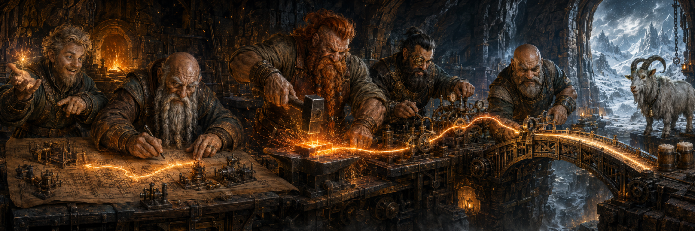
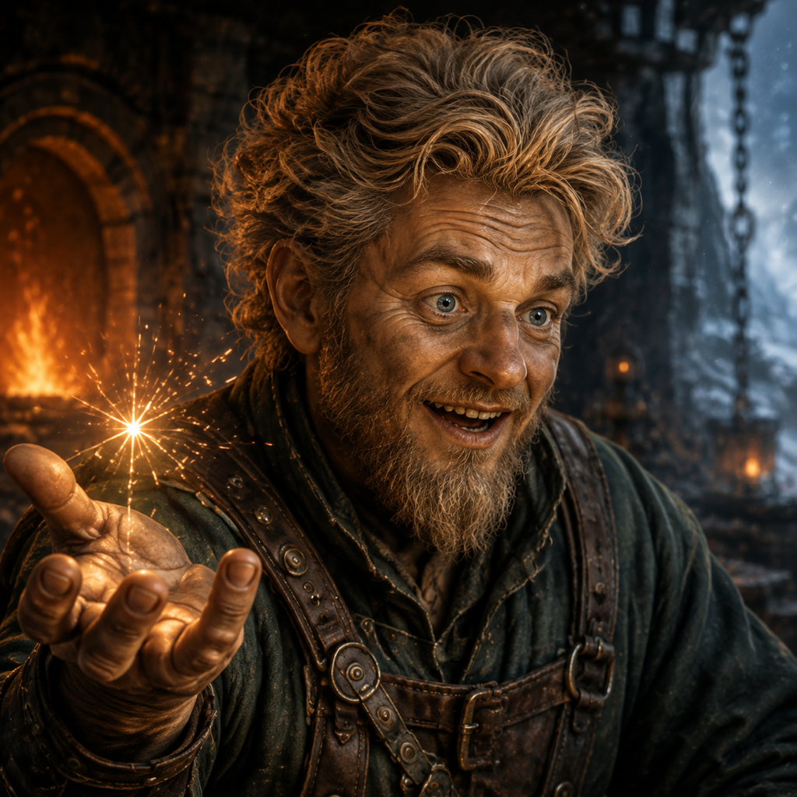
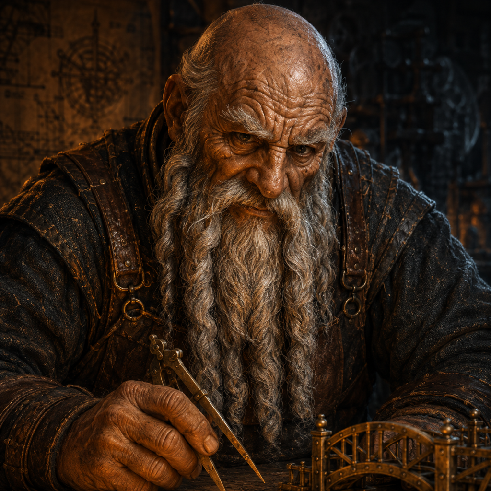
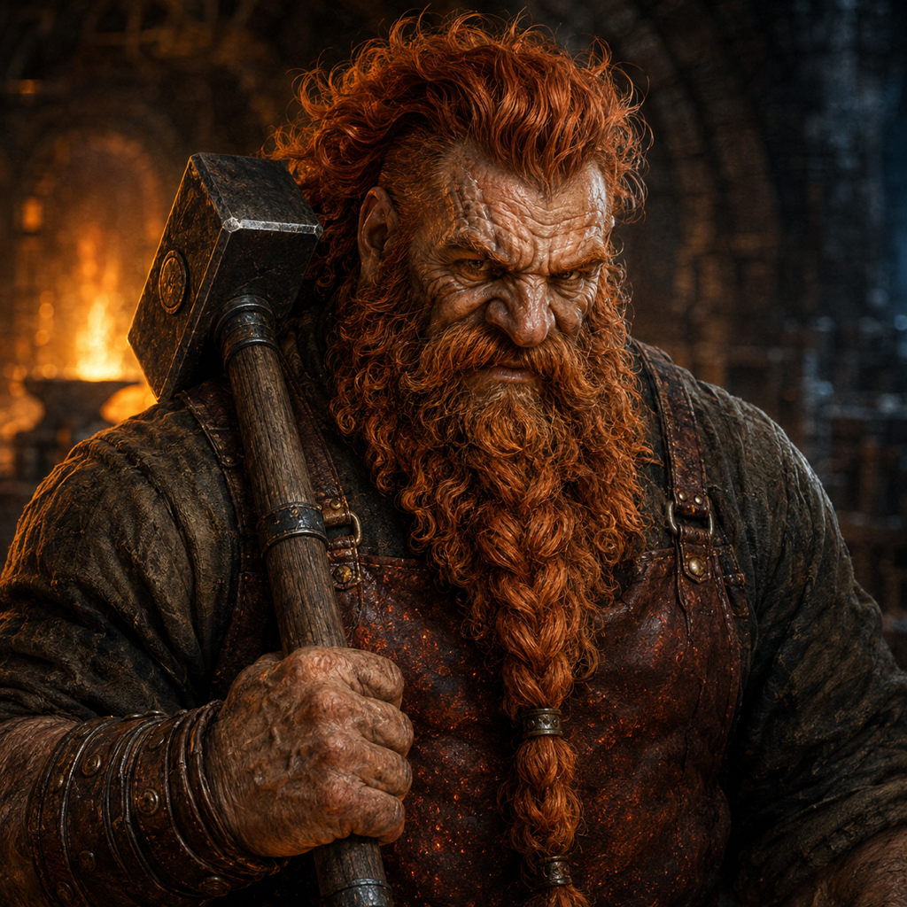
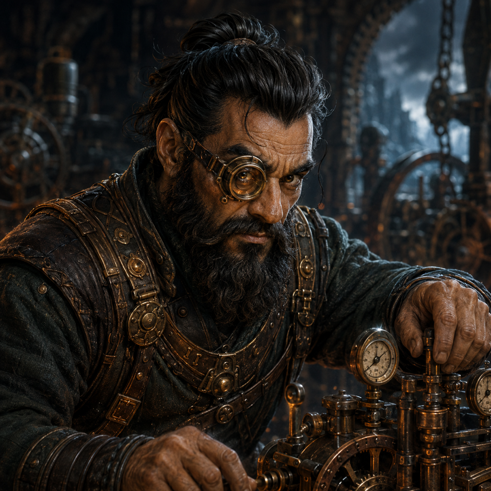
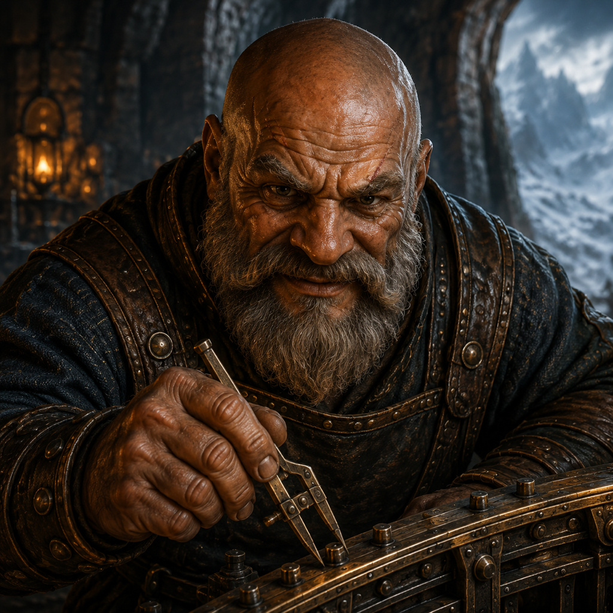
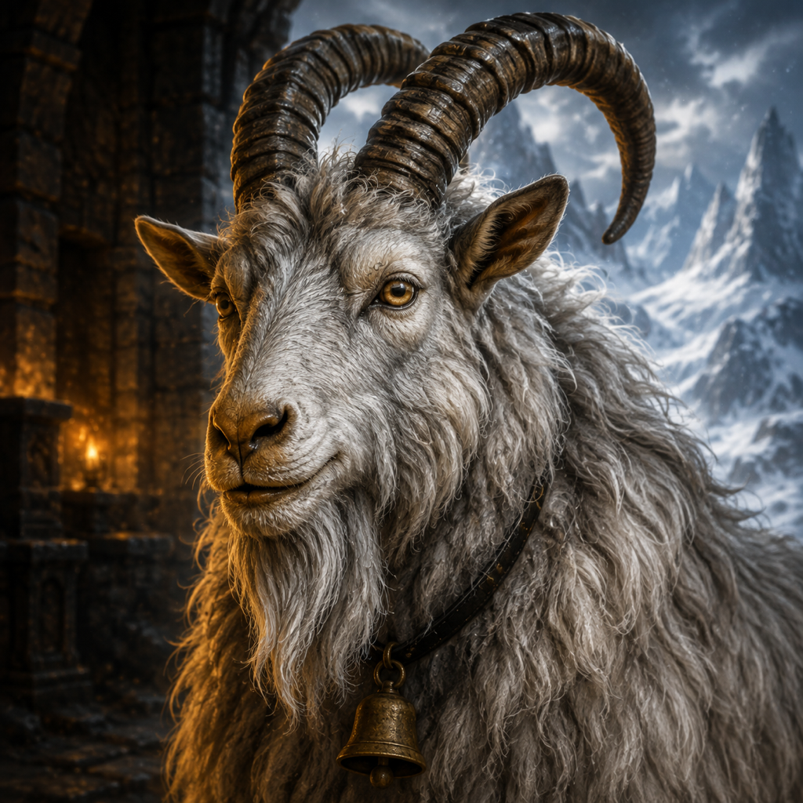

# The Five of the Living Thread

Forge's visual mythology is set in the Underforge, a workshop carved into the
roots of Jötunheim. Above it, storms break mountains. Below it, five dwarfs turn
things that exist only in someone's head into things that work in the world.

They call that passage the **Living Thread**. It begins as a spark, runs through
questions, plans, hot metal, machinery, and proof, and lights only when the work
is truly finished. No dwarf owns the whole thread. Each is responsible for one
part of its journey and for an honest handoff to the next.

The great machine in the hero image is **the Span**. It is not one particular
bridge or product. It is every idea that crossed from imagination into durable
reality because the guild had enough time, evidence, craft, and persistence to
finish it.

The pre-Roman Irish comparison set is
[The Company of the Bright Road](CHARACTERS_CELTIC.md).

## The guild at a glance

| Character | Station | Forge meaning | Signature |
| --- | --- | --- | --- |
| Kári Sparkhand | Kindling | Intent and imagination | The first spark |
| Sten Deepmeasure | Delving | Research, plans, and trials | Dividers and prototypes |
| Ragn Embermane | Making | Implementation and remediation | The square forge hammer |
| Sindri Gearwise | Driving | Orchestration, recovery, and handoffs | The brass eyepiece |
| Haldor Ironproof | Proving | Verification, review, and evidence | The precision caliper |
| Mosi the Bell-Keeper | Threshold | Completion, memory, and mischief | The bronze bell |

The mead is poured only after Haldor gives the Ironmark and Mosi rings his bell.
This is not tradition for tradition's sake. The guild celebrates finished work,
not hopeful claims.

## Kári Sparkhand — the Kindler

**Profile.** Kári is the youngest of the Five, quick-eyed, restless, and
incapable of walking past an interesting possibility. He represents the person
with the original idea: the question, desire, annoyance, or half-formed dream
that gives the guild a direction.

**Lore.** Kári earned his name during the Winter Without Dawn. While the elders
argued over an empty hearth, he caught a windblown ember in his bare hand and
carried it through the dark galleries to the cold forge. The ember should have
died. Instead, it became the first Living Thread. Kári has been catching
unlikely sparks ever since.

He does not pretend that an idea is a plan. His gift is recognizing which
sparks deserve air, naming what they might become, and trusting the other four
to challenge them.

**Temperament.** Curious, irreverent, generous, optimistic, and impatient with
the phrase “someone should.” He speaks in possibilities and laughs when a wild
idea survives its first hard question.

**Visual anchors.** Adult male dwarf; lively angular face; bright gray-blue
eyes; arched brows; high cheekbones; tousled ash-blond hair; short pointed
ash-blond beard; dark pine wool; battered brown leather forge straps. His
signature prop is a tiny amber-white spark hovering above an open palm.

**Continuity rules.** Keep him compact and sturdy, never boyish or human-tall.
Do not give him a long beard, helmet, weapon, eyepiece, red hair, or solemn
expression. His spark is small and precious, not a fireball.

**Canonical generation description:**

> Kári Sparkhand, the Kindler: an adult male Norse-mythic dwarf with a compact
> sturdy build, lively angular weathered face, bright gray-blue eyes, arched
> expressive brows, high cheekbones, tousled ash-blond hair swept upward, and a
> short neatly pointed ash-blond beard. He wears a dark pine wool work tunic and
> battered brown leather forge straps. A tiny amber-white living spark hovers
> above his open palm. Curious, delighted, quick, and inviting.

## Sten Deepmeasure — the Delver

**Profile.** Sten turns possibility into knowledge. He maps unknown ground,
finds prior craft, isolates risk, makes small models, and records why an attempt
failed. He represents research and trial before expensive construction.

**Lore.** Sten once spent nine years surveying a tunnel the old maps called
impossible. Eight routes ended in ice, poison stone, or giant roots. The ninth
opened into the chamber that became the Underforge. Asked whether the first
eight years were wasted, he replied, “They are the walls that keep the ninth
path standing.”

His benches are crowded with rejected mechanisms. Nothing is hidden. Every
broken model is evidence another dwarf will not have to buy twice.

**Temperament.** Patient, skeptical, exact, dryly funny, and impossible to rush
with confidence alone. He prefers one measured fact to a hall full of opinions.

**Visual anchors.** Elderly male dwarf; long hawk-like face; close-shaved bald
crown; heavy white eyebrows; broad weathered nose; intense dark eyes; very long
forked silver-white beard; charcoal wool coat; worn umber drafting apron. His
signature props are brass measuring dividers and small bridge prototypes.

**Continuity rules.** His face is long rather than square, and his beard is
silver and divided into two heavy forks. Do not give him Kári's grin, Ragn's red
hair, Sindri's eyepiece, Haldor's trimmed beard, or a wizard's robe.

**Canonical generation description:**

> Sten Deepmeasure, the Delver: an elderly male Norse-mythic dwarf with massive
> compact shoulders, a deeply lined long hawk-like face, heavy white eyebrows,
> close-shaved bald crown with a faint gray fringe, intense dark eyes, broad
> weathered nose, and an exceptionally long forked silver-white beard. He wears
> a charcoal wool research coat and worn umber leather drafting apron and works
> with brass dividers and precise mechanical prototypes. Quiet, skeptical, and
> endlessly patient.

## Ragn Embermane — the Maker

**Profile.** Ragn makes the plan pay rent. He turns accepted constraints into
real components, discovers the truths that appear only under load, and repairs
what the first attempt got wrong. He represents implementation and remediation.

**Lore.** Ragn apprenticed in a giant's gate-forge, where speed mattered more
than care and flaws were buried under decoration. When one of those gates split
in a winter storm, Ragn carried every broken hinge back to his own anvil. He
forged them into the first Span and stamped the underside with a promise: no
pride in the first strike, only in the work that holds.

He keeps a bucket of failed pieces beside the anvil. He calls it tuition.

**Temperament.** Intense, direct, exuberant, loyal, and allergic to ceremonial
work. He enjoys a hard correction almost as much as a clean build because both
move the artifact toward truth.

**Visual anchors.** Massive adult male dwarf; enormous shoulders; broad battered
face; low fierce brow; broken nose; pale forge scar at one temple; flame-red
wavy mane; dense flame-red beard gathered into one long central braid; dark
wool shirt; oxblood leather apron; iron wrist bracers. His signature prop is a
square-faced working hammer.

**Continuity rules.** Ragn is the largest of the Five and the only redhead. Keep
one central beard braid, not multiple decorative braids. He is a smith, not a
warrior: no armor, axe, shield, or battle pose.

**Canonical generation description:**

> Ragn Embermane, the Maker: a massive adult male Norse-mythic dwarf with
> enormous shoulders, thick neck, broad battered face, low fierce brow, broken
> broad nose, pale forge scar at one temple, deep-set amber-brown eyes, a
> flame-red wavy mane, and an exceptionally dense flame-red beard gathered into
> one long heavy central braid. He wears a smoke-dark wool shirt, oxblood leather
> smithing apron, and iron wrist bracers and carries a square-faced forge hammer.
> Intense, capable, and fiercely delighted by difficult work.

## Sindri Gearwise — the Driver

**Profile.** Sindri makes independent work move as one system. He sequences the
stations, preserves every handoff, watches for stalls, and recovers the mechanism
after interruption. He represents durable orchestration without stealing the
judgment of the specialists.

**Lore.** Before the Underforge, Sindri tended the Clock of Three Winters, a
mountain engine so large that no keeper could see all of it. When an avalanche
sealed half its galleries, the clock continued because Sindri had taught each
station how to remember its last honest state. He arrived at the guild carrying
one brass lens and the conviction that interruption is not failure—forgetting
where you were is.

He never claims another dwarf's hammer. His craft is the thread between hands.

**Temperament.** Alert, restrained, dry, calm during trouble, and always several
moves ahead. He distrusts invisible state and loves a clean, explicit handoff.

**Visual anchors.** Wiry adult male dwarf; sharp triangular face; high narrow
cheekbones; long straight nose; deep-brown eyes; black hair in a tight high knot;
short square black beard with a pointed chin; single round brass eyepiece over
his right eye; charcoal-green wool engineer's coat; precise dark leather
harness. His signature station is a linked cluster of gauges, levers, and gears.

**Continuity rules.** Sindri is wiry rather than massive. Preserve the single
right-eye brass lens, tied black hair, and short beard. Do not turn him into a
double-goggled mad inventor or cover him in decorative steampunk machinery.

**Canonical generation description:**

> Sindri Gearwise, the Driver: a wiry compact adult male Norse-mythic dwarf with
> a sharp triangular face, high narrow cheekbones, long straight nose, intense
> deep-brown eyes, black hair pulled into a tight high knot, a short square black
> beard with a slightly longer pointed chin, and one round brass mechanical
> eyepiece over his right eye. He wears a fitted charcoal-green wool engineer's
> coat and precise dark leather harness and operates linked brass gauges,
> levers, and gear trains. Composed, watchful, and three moves ahead.

## Haldor Ironproof — the Prover

**Profile.** Haldor tries to break the finished work before the mountain can.
He compares promise with artifact, examines evidence, and sends defects back
without softening them or shaming their maker. He represents verification and
review as protection for both users and craft.

**Lore.** Haldor was the sole survivor of the Bright Arch collapse. The bridge
had been beautiful, early, and praised by everyone who had not measured its
pins. He emerged carrying one sheared rivet and never again accepted applause as
evidence. The rivet became his first caliper; the scar above his eye became the
reason nobody resents his questions for long.

When work passes, Haldor presses a small iron mark beneath it where only the
makers will see. His rare smile is the signal to find the mead.

**Temperament.** Severe, incorruptible, practical, protective, and secretly
delighted by excellent work. He attacks the artifact, never the craftsman.

**Visual anchors.** Older male dwarf; fully shaved scarred head; blunt rectangular
face; heavy square jaw; flattened nose; pale scar through the left eyebrow;
steel-gray eyes; thick iron-gray moustache; broad neatly trimmed iron-gray beard;
blackened-blue wool coat; riveted dark leather verifier's harness. His signature
prop is a brass-and-steel precision caliper.

**Continuity rules.** Haldor's beard is broad and trimmed, never long or forked.
Keep the left-eyebrow scar and shaved head. He is a craft verifier, not an angry
soldier; no weapons, armor, or cruelty.

**Canonical generation description:**

> Haldor Ironproof, the Prover: an older powerful male Norse-mythic dwarf with a
> fully shaved scarred head, blunt rectangular face, heavy square jaw, broad
> flattened nose, pale scar cutting through his left eyebrow, deep-set steel-gray
> eyes, thick iron-gray moustache, and broad neatly trimmed iron-gray beard. He
> wears a blackened-blue wool work coat and riveted dark leather verifier's
> harness and tests finished mechanisms with a brass-and-steel precision caliper.
> Severe, protective, exact, with a rare earned half-smile.

## Mosi — the Bell-Keeper

**Profile.** Mosi is a shaggy mountain goat and the only creature permitted to
cross every station without announcing himself. He represents the stubborn
continuity of the guild: dropped pieces return, forgotten makers are found, and
someone is always watching the threshold.

**Lore.** Mosi walked into the Underforge during a blizzard with a missing brass
pin tangled in his coat. The pin completed the first Span. Nobody discovered
where he found it, so Sten gave him a bell and Haldor granted him permanent
inspection rights.

Mosi rings the bell once when Haldor gives the Ironmark. He is also known to eat
obsolete plans, but never before Sten has recorded what they taught.

**Temperament.** Calm, clever, mildly judgmental, stubborn, and perfectly timed.

**Visual anchors.** Sturdy adult male mountain goat; long shaggy smoke-white coat
with gray underlayers; pale amber eyes; narrow charcoal muzzle; symmetrical dark
gray horns sweeping upward and back; pointed ears; worn bronze bell on a simple
dark leather collar.

**Continuity rules.** Mosi is a natural goat, not a talking or humanoid mascot.
His horns are natural and required. Do not add armor, packs, glowing eyes, extra
horns, or a human smile.

**Canonical generation description:**

> Mosi, the Bell-Keeper: a sturdy adult male mountain goat with a long shaggy
> smoke-white coat and soft gray underlayers, intelligent pale amber eyes,
> narrow charcoal muzzle, symmetrical dark gray natural horns sweeping upward
> and back, pointed ears, and a small worn bronze bell on a simple dark leather
> collar. Calm, clever, mildly judgmental, and entirely at home in the forge.

## Scene-generation contract

The portrait assets are the canonical identities. The v7 hero establishes the
canonical Underforge environment, palette, and group relationship.

For consistent future scenes:

1. Attach `assets/forge-hero-v7.png` as the world and style reference.
2. Attach the portrait of every character appearing in the scene as a separate
   identity reference.
3. Name each character and repeat that character's canonical generation
   description. Do not ask the model to infer an identity from role alone.
4. State which reference controls identity and which controls environment.
5. Give each dwarf only his canonical hair, face, wardrobe family, and signature
   prop. Actions and camera angles may change; identity anchors may not.
6. Require visibly different faces, silhouettes, poses, and beard shapes in
   every group image. Explicitly prohibit face blending and duplicated features.
7. Keep all dwarfs adult, male, short, stocky, and practical. They are craftsmen,
   not warriors. Use work clothes, not fantasy armor or horned helmets.
8. Preserve the Underforge's dual light: hot amber craft inside, cold blue-white
   Jötunheim weather outside. Use blackened iron, brass, basalt, leather, wool,
   snow, sparks, and steam.
9. Show a handoff or shared consequence whenever multiple guild members appear.
   Avoid passive lineups. The Living Thread should connect their work when the
   full lifecycle is the subject.
10. Use no readable text, fake runes, logos, watermarks, modern electronics, or
    generic interface overlays inside generated scenes.

A reusable scene prompt should begin like this:

> Use `forge-hero-v7.png` as the Underforge world, lighting, material, and style
> reference. Use the attached character portraits as strict identity references;
> preserve each face, hair, beard, wardrobe family, build, and signature prop.
> Create a cinematic old-master scene in which [named characters] [specific
> action and handoff]. Keep their identities visibly distinct. Warm amber forge
> light meets cold Jötunheim storm light. No text, logos, armor, weapons, horned
> helmets, face blending, duplicated features, or passive lineup.

When a newly generated portrait conflicts with this document, the checked-in
canonical portrait wins for appearance and this document wins for behavior and
lore.
