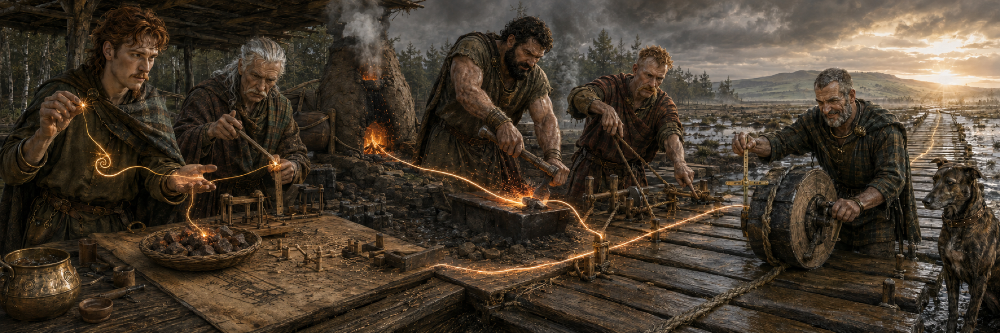
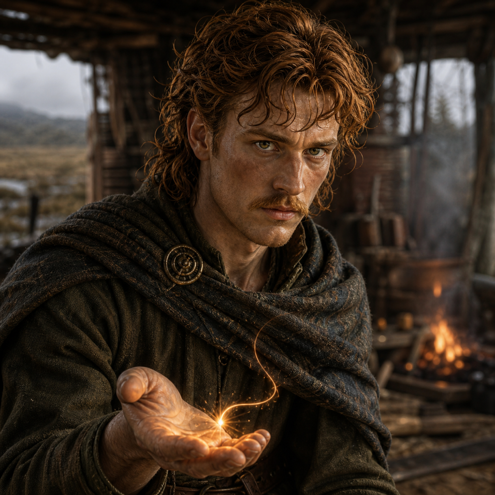
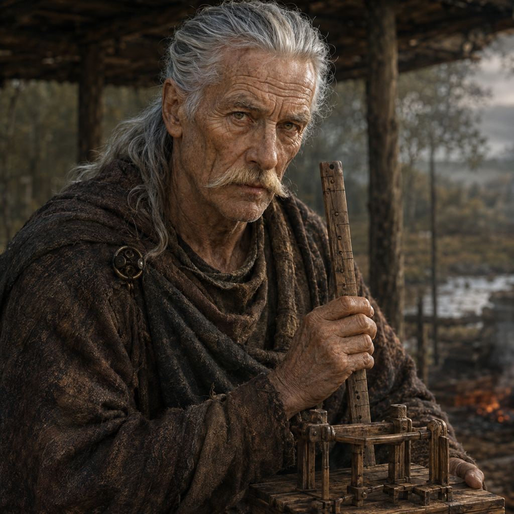
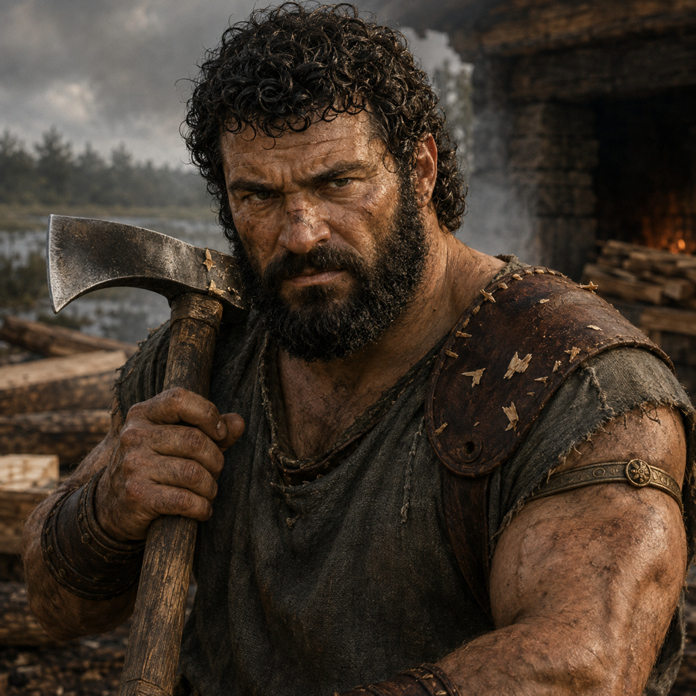
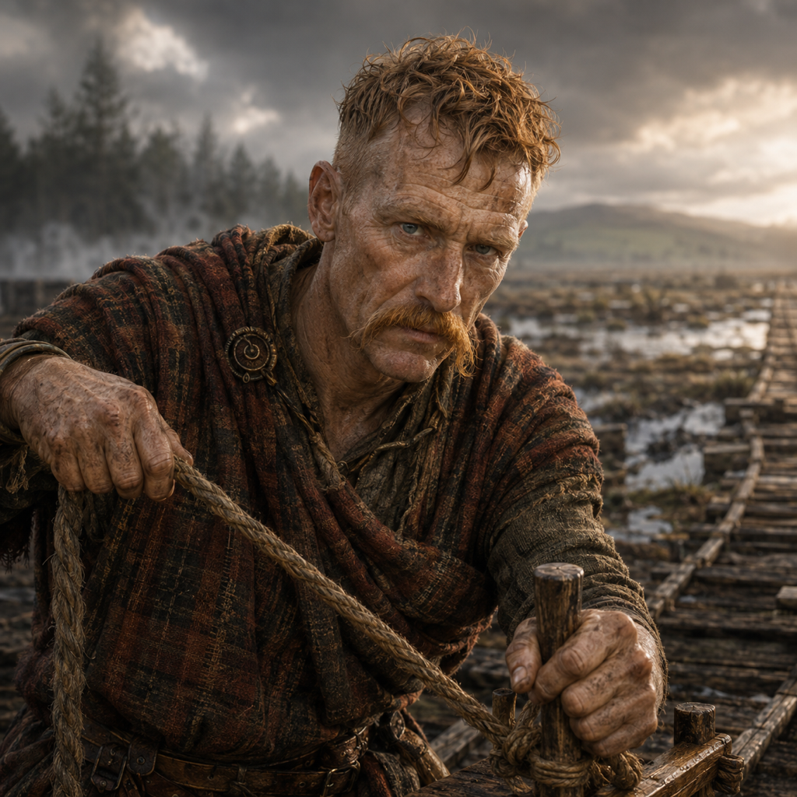
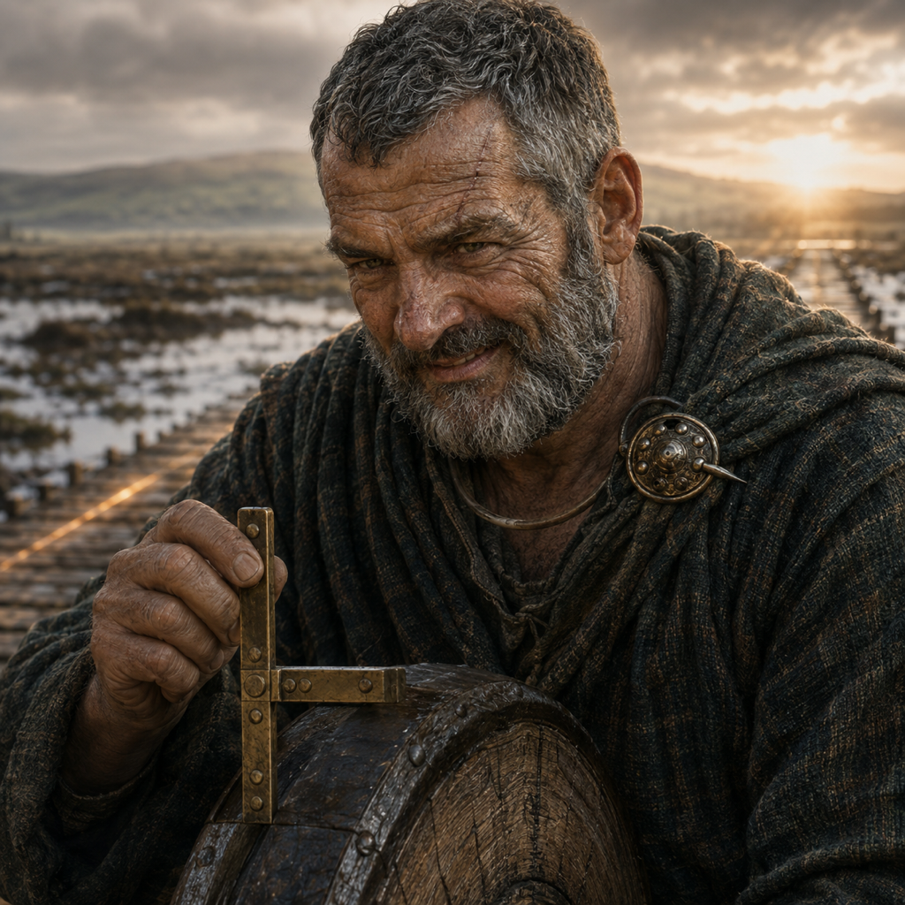
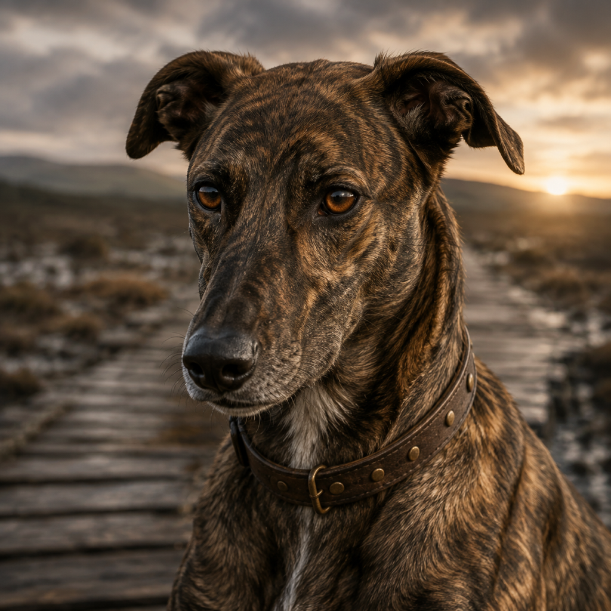

# The Company of the Bright Road

This comparison canon moves Forge's visual mythology from the mountains of
Jötunheim to pre-Roman Iron Age Ireland. Five craftsmen work at the edge of a
raised bog around 150 BC. Their task is the **Long Crossing**, a heavy-oak road
over ground that swallows careless work.

They call the idea moving between them the **Bright Line**. It begins as a spark
in one mind. Fintan investigates until he can select one honest piece of
**ore**: a bounded work item whose source, desired shape, constraints, and proof
are known. The ore enters the **Road Forge**, where fire and five distinct
crafts turn it into iron tools, oak joints, coordinated construction, and a
tested crossing. The line is beautiful, but beauty is not its proof. Only a
road that carries weight is.

The Underforge comparison set is [The Five of the Living Thread](CHARACTERS.md).

## Historical grounding

This is Forge's fictional house mythology, not a claim of literal historical
reconstruction. Its material world is anchored in Irish Iron Age archaeology:

- Heritage Ireland dates the Corlea togher to 148 BC and describes its heavy oak
  planks crossing the Longford bog. The Long Crossing takes that extraordinary
  work as its practical inspiration.
- The National Museum of Ireland describes the arrival of La Tène objects in
  third-century-BC Ireland, subsequent native production, and the adoption of
  ironworking. Its Iron Age collections also preserve bronze, gold, tools,
  feasting vessels, wooden objects, and horse fittings.
- An excavated Iron Age furnace at Mullagh, County Longford, produced a
  radiocarbon date of 409–386 BC. Its surrounding bogs may have supplied ore for
  local industrial processing. The Road Forge's bog ore, charcoal, slag, and
  compact clay furnace are grounded in that evidence.
- La Tène decoration is curvilinear: restrained trumpet forms, spirals, S-curves,
  foliage, and animal forms. Later manuscript interlace and modern “Celtic”
  stereotypes do not belong in this visual world.

References:

- [Corlea Iron Age Roadway and Visitor Centre](https://heritageireland.ie/places-to-visit/corlea-iron-age-roadway/)
- [Guide to the National Museum of Ireland](https://www.museum.ie/getmedia/a3ebbb22-2057-4200-aae8-cd958854d89f/ks_guide_web_en-(1).pdf)
- [Blowing our own Trumpet for the Irish Iron Age](https://source.museum.ie/en-IE/Collections-Research/Irish-Antiquities-Division-Collections/Irish-Antiquities-Articles/All-in-a-Days-work/Blowing-our-own-trumpet)
- [Mullagh Iron Age furnace excavation](https://excavations.ie/report/2009/Longford/0020907/)

## The Forge cycle

| Lore | Visible form | Forge meaning |
| --- | --- | --- |
| Spark | The light in Aedán's palm | An idea worth exploring |
| Reading | Fintan's surveys, trials, and models | Planning and research |
| Ore | One chosen bog-iron piece on Fintan's bench | A complete admitted work item |
| Road Forge | Furnace plus the full chain of custody | Durable execution and recovery |
| Forged iron | Cormac's bloom, tools, and fittings | Implementation and remediation |
| Binding | Niall's ropes, pegs, order, and handoffs | Orchestration of independent work |
| Sure Step | Conall's gauge and weighted trial | Review, evidence, and verification |
| Long Crossing | The oak road reaching sunrise | Finished, landed work |

The clay bloomery is the Road Forge's hot heart, but the **Forge is not merely
the furnace**. It is the whole accountable passage from admitted ore to proven
road. Likewise, ore is not every interesting stone in the bog. It is the one
work-piece made complete enough to enter execution without asking the fire to
invent its purpose.

## The company at a glance

| Character | Station | Forge meaning | Signature |
| --- | --- | --- | --- |
| Aedán Brightmind | Kindling | Intent and imagination | The first spark |
| Fintan Reedwise | Admitting | Research, specification, and readiness | The chosen ore |
| Cormac Oakhand | Forging | Implementation and remediation | Bloom, hammer, and adze |
| Niall Linkbinder | Driving | Orchestration and handoffs | Rope and fitted pegs |
| Conall Surestep | Proving | Verification, review, and evidence | The bronze gauge |
| Bran the Road Hound | Boundary | Continuity, memory, and trust | The bronze-studded collar |

The feasting cauldron is opened only after Conall takes the Sure Step and Bran
walks the first full length without hesitation. The Company celebrates a road
that carries people, not a plan that merely looked convincing.

## Comparison with the Underforge

| Bright Road | Underforge | Shared responsibility |
| --- | --- | --- |
| Aedán Brightmind | Kári Sparkhand | Give the spark intent |
| Fintan Reedwise | Sten Deepmeasure | Turn uncertainty into complete ore |
| Cormac Oakhand | Ragn Embermane | Forge and repair the real artifact |
| Niall Linkbinder | Sindri Gearwise | Coordinate durable handoffs |
| Conall Surestep | Haldor Ironproof | Test the promise against reality |
| Bran | Mosi | Remember boundaries and mark completion |

The Underforge is enclosed, mechanical, hot, and vertical. The Bright Road is
open, organic, wet, and horizontal. One resists interruption inside a machine;
the other carries coordinated work across uncertain ground.

## Aedán Brightmind — the Kindler

**Profile.** Aedán recognizes a possible path before anyone knows whether the
ground will carry it. He represents the person with the original idea: not a
finished specification, but a useful direction and a reason to explore it.

**Lore.** During a season of rain, Aedán watched a shaft of sunset travel across
the bog from one pool to another. For a breath, light made a road where no road
existed. He returned the next morning with Fintan and a question: if light could
find a crossing, could oak?

The Bright Line first appeared in Aedán's palm that day. It still arrives as a
small thing. He has learned not to inflate it with certainty. His duty is to
hold it long enough to describe the destination and then give it to Fintan. He
kindles the spark; he does not declare the ore ready.

**Temperament.** Imaginative, observant, eloquent, restless, and grounded. He is
more inward than Kári, but no less delighted when a difficult possibility
becomes real.

**Visual anchors.** Young adult human man; lean athletic build; long narrow face;
alert green eyes; straight narrow nose; strong brows; tousled copper-brown wavy
hair; light neat copper moustache; otherwise clean-shaven; dark moss-green wool
tunic; muted brown cloak with a simple shoulder pin. His signature prop is a
tiny amber-gold spark above an open palm.

**Continuity rules.** Keep ordinary human height and proportions. Aedán has a
light moustache, never a full beard. Do not give him a robe, staff, weapon,
torc, blue body paint, or supernatural glowing eyes. The spark remains small.

**Canonical generation description:**

> Aedán Brightmind, the Kindler: a young adult pre-Roman Irish Celtic human man
> with a lean athletic build, long narrow face, alert green eyes, straight
> narrow nose, strong brows, tousled copper-brown wavy hair, and a light neat
> copper moustache over an otherwise clean-shaven jaw. He wears a practical dark
> moss-green wool tunic and muted brown woven cloak pinned simply at one
> shoulder. A tiny amber-gold spark hovers above his open palm. Absorbed,
> imaginative, grounded, and quietly confident.

## Fintan Reedwise — the Seeker

**Profile.** Fintan reads the ground before the Company spends its oak or lights
the furnace. He maps water, peat depth, buried timber, seasonal change, old
failed routes, and the quality of local bog iron. He represents research,
specification, and the readiness judgment that turns a possibility into ore.

**Lore.** Fintan learned the bog by searching for a cart and driver lost in a
winter fog. He never found the cart, but he found three layers of forgotten
paths beneath the reeds. Each had failed differently. From them he learned that
the ground remembers every shortcut even when people do not.

He marks his hazel rods with depth, resistance, season, and doubt. His smallest
models are weighted and left in wet peat overnight. A route that survives his
bench earns the right to consume a tree. He then chooses one piece from the ore
tray and records the shape it must become, the constraints it must survive, and
the proof Conall will require. Only then does he pass it to the Road Forge.

The Company uses **ore** as both material and promise. An unexamined stone is
only possibility. Fintan's chosen ore is complete, bounded, and admitted to the
fire without leaving its purpose for Cormac to guess.

**Temperament.** Patient, grave, curious, economical with words, and quietly
amused when evidence humiliates certainty.

**Visual anchors.** Elderly rangy human man; deeply lined long oval face; high
forehead; long swept-back silver hair tied low; sweeping heavy silver moustache;
clean-shaven chin and cheeks; hazel eyes; long slightly hooked nose; peat-brown
wool tunic; dark heather cloak. His signature props are a marked hazel depth rod
and a small oak trackway model. In lifecycle scenes, a shallow tray of rough
rust-brown bog ore sits before him and one selected piece catches the Bright
Line.

**Continuity rules.** Fintan has no beard. Keep his tied silver hair, long face,
heavy moustache, and rangy human build. He is a field investigator, not a druid
or wizard: no ceremonial robe, staff, antlers, prophecy pose, or magic symbols.

**Canonical generation description:**

> Fintan Reedwise, the Seeker: an elderly rangy pre-Roman Irish Celtic human man
> with a deeply lined long oval face, high forehead, long swept-back silver hair
> tied low, sweeping heavy silver moustache, clean-shaven chin and cheeks,
> weathered hazel eyes, long slightly hooked nose, and prominent cheekbones. He
> wears a practical peat-brown wool tunic and weathered dark heather cloak and
> works with a marked hazel depth rod, small oak trackway models, and a shallow
> tray of rough rust-brown bog iron. One deliberately selected ore piece is his
> admitted work item. Patient, grave, observant, and skeptical.

## Cormac Oakhand — the Maker

**Profile.** Cormac is the Road Forge's smith and woodwright. He smelts admitted
bog ore with charcoal in the clay bloomery, works the hot bloom into iron tools
and fittings, then splits, shapes, fits, and repairs the oak. He represents
implementation and the new truths discovered only inside the real artifact.

**Lore.** Cormac grew up among storm-felled oaks. His father taught him that a
tree records every hard season in its grain, and that fighting the grain makes
weak work. Cormac applied the same lesson to plans: force them blindly and they
split; read them under the blade and they reveal their strongest form.

He keeps every failed joint, cracked tool, and slag-heavy bloom near the hearth
until the road is finished. Some are reshaped. Some become fuel. None disappear
before the lesson is handed on. To Cormac, the forge is where a precise promise
first meets heat, cost, weight, and consequence.

**Temperament.** Direct, energetic, loyal, physically fearless, and happiest
when progress can be touched, weighed, and corrected.

**Visual anchors.** Very broad muscular human man in his prime; square rugged
face; heavy brow; dark brown eyes; broken broad nose; thick short black curly
hair; short dense black curly beard; sleeveless smoke-gray wool tunic; worn
oxblood leather shoulder guard and wrist wraps. His signature prop is a
practical iron woodworking adze dusted with fresh oak chips. In lifecycle
scenes, add his low stone anvil, working hammer, hot iron bloom, and the compact
clay-and-stone charcoal furnace behind him.

**Continuity rules.** Cormac is the largest of the Company but remains an
ordinary human, never dwarf-proportioned. His tool is an adze, not a battle axe.
No warrior armor, shield, blue paint, red hair, long beard, or heroic combat
pose.

**Canonical generation description:**

> Cormac Oakhand, the Maker: a very broad muscular pre-Roman Irish Celtic human
> man in his prime with a square rugged face, heavy brow, dark brown eyes,
> clearly broken broad nose, thick short black curly hair, and a short dense
> black curly beard. He wears a sleeveless smoke-gray wool work tunic, worn
> oxblood leather shoulder guard, and wrist wraps and carries a practical iron
> woodworking adze marked with fresh oak chips. Direct, capable, energetic, and
> grounded. At the Road Forge he also works a hot iron bloom with a practical
> hammer beside a compact clay-and-stone charcoal furnace.

## Niall Linkbinder — the Coordinator

**Profile.** Niall makes separate pieces become one road. He sequences deliveries,
keeps rope teams and lever crews aligned, tracks fitted pegs, and preserves the
state of each unfinished section when weather stops the work. He represents
durable orchestration and explicit handoffs.

**Lore.** Niall once led an oak raft through a flooded wood after every familiar
marker vanished. He tied a different simple cord at each safe turn and could
reconstruct the whole journey after the water fell. At the Long Crossing, his
cords no longer mark trees; they mark responsibility, order, and the last honest
state of work.

Niall is not the finest adze-man, surveyor, or judge. His craft is ensuring the
finest work of each arrives where the whole effort needs it.

**Temperament.** Alert, commanding, plainspoken, composed under pressure, and
intolerant of hidden dependencies.

**Visual anchors.** Wiry middle-aged human man; sharp triangular face; bright
blue eyes; narrow crooked nose; red-blond hair cropped at the sides and tousled
on top; long drooping red-blond moustache; bare chin; muted madder-red and
peat-brown wool; narrow leather work belt. His signature props are taut hemp
rope, fitted oak pegs, and a small alignment frame.

**Continuity rules.** Preserve the bare chin, long moustache, short-sided hair,
and lean build. His ropes are practical controls, not decorative Celtic knots.
No beard, elaborate braids, weapon, armor, helmet, or ritual costume.

**Canonical generation description:**

> Niall Linkbinder, the Coordinator: a wiry middle-aged pre-Roman Irish Celtic
> human man with a sharp triangular weathered face, bright blue eyes, narrow
> crooked nose, red-blond hair cropped at the sides and tousled on top, a long
> drooping red-blond moustache, completely bare chin, and prominent cheekbones.
> He wears muted madder-red and peat-brown wool with a narrow leather work belt
> and coordinates taut hemp ropes, fitted oak pegs, levers, and alignment
> frames. Alert, composed, commanding, and several handoffs ahead.

## Conall Surestep — the Prover

**Profile.** Conall loads the road before anyone trusts it with a journey. He
checks alignment, joints, movement, edge stability, and the evidence left by
each trial. He represents verification as protection for travelers and makers,
not punishment for mistakes.

**Lore.** Before joining the Company, Conall guided people across seasonal bog
paths. One summer, a familiar path moved beneath clear weather and took a laden
horse. Conall stopped trusting memory without measurement. He built a weighted
oak wheel that could place the force of a journey on one joint at a time.

The first person to cross the Long Crossing will never know which pins Conall
rejected. That anonymity is his idea of excellent work.

**Temperament.** Exacting, incorruptible, practical, protective, and capable of
a restrained smile only after the result has earned it.

**Visual anchors.** Older thick-set human man; broad rectangular weathered face;
close-cropped iron-gray curls; short neat iron-gray beard and moustache; dark
skeptical eyes; broad slightly bent nose; pale scar through the right eyebrow;
charcoal and forest-green wool; simple bronze shoulder pin. His signature props
are a compact bronze gauge and weighted oak test wheel.

**Continuity rules.** Keep his short curls, short beard, right-eyebrow scar, and
ordinary human proportions. He is a tester, not a warrior. No bald head, long
beard, armor, weapon, judicial robes, or hostile expression.

**Canonical generation description:**

> Conall Surestep, the Prover: an older thick-set pre-Roman Irish Celtic human
> man with a broad rectangular weathered face, close-cropped iron-gray curls,
> short neat iron-gray beard and moustache, dark skeptical eyes, broad slightly
> bent nose, and a pale scar through his right eyebrow. He wears dark charcoal
> and muted forest-green wool pinned simply at one shoulder and tests oak joints
> with a compact bronze gauge and heavy weighted wooden wheel. Exacting,
> practical, protective, with a restrained earned smile.

## Bran — the Road Hound

**Profile.** Bran is the Company's boundary keeper. He remembers the safe route,
notices moved markers before the men do, and refuses to cross work that shifts
under his feet. He represents continuity and trust earned through repeated
contact with reality.

**Lore.** Bran appeared beside Fintan during the search for the lost winter cart
and silently led him back before the fog closed. Years later, halfway across the
first Long Crossing, Bran stopped. Beneath his paws, an oak peg had split without
showing at the surface. Cormac replaced the joint, Conall changed the trial, and
Bran gained the right to walk every completed section first.

He does not bark when the work is done. He simply continues to the far bank.
That is enough to open the cauldron.

**Temperament.** Alert, steady, reserved, loyal, and quietly discerning.

**Visual anchors.** Large lean adult male hunting hound; long legs; deep chest;
narrow intelligent head; folded rose ears; warm amber eyes; black nose; short
rough brindle coat in charcoal, peat-brown, and muted tawny; small white throat
patch; worn dark leather collar with a few plain bronze studs.

**Continuity rules.** Bran is a natural dog, not a wolf or modern show-breed
Irish wolfhound. Do not add shaggy fantasy fur, armor, packs, glowing eyes,
oversized fangs, or a human smile.

**Canonical generation description:**

> Bran, the Road Hound: a large lean adult male Celtic hunting hound with long
> legs, deep chest, narrow intelligent head, folded rose ears, warm amber eyes,
> black nose, short rough brindle coat in dark charcoal, peat-brown, and muted
> tawny striping, a small white throat patch, and a simple worn dark leather
> collar with a few plain bronze studs. Alert, steady, reserved, loyal, and
> quietly discerning.

## Scene-generation contract

The individual portraits are canonical identities. The v2 Celtic hero image is
the canonical world, palette, group relationship, and Long Crossing reference.

For consistent future scenes:

1. Attach `assets/forge-celtic-hero-v2.png` as the world and style reference.
2. Attach the canonical portrait of every character present as a separate,
   strict identity reference.
3. Name every character and repeat his canonical generation description. State
   explicitly that the men have normal human height and proportions.
4. Preserve each man's face, build, hair, facial hair, clothing family, and
   signature tool. Change action and camera angle, not identity.
5. Require visibly different faces, silhouettes, ages, and poses. Prohibit face
   blending, duplicated moustaches, and generic lineups.
6. Ground the setting in wet oak, dark peat, reeds, silver water, wool, leather,
   rough rust-brown bog ore, charcoal, a compact clay bloomery, slag, hot iron
   bloom, iron tools, bronze details, rain, mist, and low Irish light.
7. Use restrained La Tène curves only on appropriate small metal fittings. Do
   not substitute later manuscript knotwork or cover every object in ornament.
8. Show a real handoff, dependency, or shared consequence whenever several
   Company members appear. The Bright Line may connect stages when the full
   lifecycle is the subject. That lifecycle must read spark → complete ore →
   Road Forge → coordinated craft → proof → finished crossing.
9. Keep the period pre-Roman and pre-Christian: no Roman architecture or dress,
   ogham, crosses, illuminated manuscripts, medieval castles, kilts, tartan,
   blue face paint, druid robes, fantasy armor, or modern tools.
10. Keep this set culturally separate from the Underforge: no dwarfs, Norse
    runes, Viking braids, horned helmets, longships, Jötunheim, goats, or
    blackened mechanical bridge engines.
11. Use no readable text, fake writing, logos, watermarks, or interface overlays
    inside generated scenes.

A reusable scene prompt should begin like this:

> Use `forge-celtic-hero-v2.png` as the pre-Roman Irish Road Forge, Long Crossing,
> lighting, material, and style reference. Use the attached portraits as strict
> identity references for [named characters]; preserve each face, build, hair,
> facial hair, wool clothing family, and signature tool. Create a cinematic
> old-master scene in which [specific action and handoff]. If the full lifecycle
> is present, show one Bright Line moving from spark to selected bog-ore work
> item, clay bloomery, forged iron, coordinated oak work, proof, and completed
> road. Keep all men at
> ordinary human proportions and visibly distinct. Wet oak and dark peat meet
> cool Irish mist and warm charcoal light. No text, face blending, duplicated
> features, Romans, Christianity, ogham, medieval knotwork, tartan, kilts, blue
> paint, druid robes, Vikings, dwarfs, fantasy armor, or passive lineup.

When a generated scene conflicts with this document, the checked-in portraits
win for identity, the hero image wins for environment, and this document wins
for behavior and lore.
